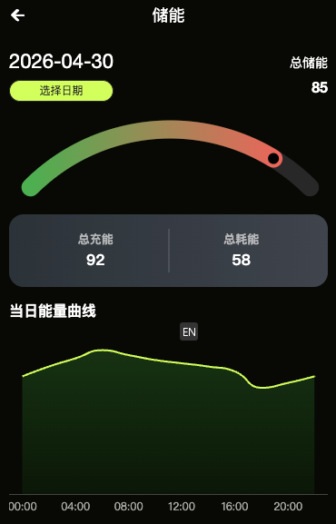
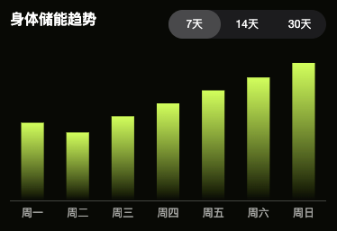

# 储能页面接口文档

---

## 接口1：获取储能页面基础数据


**请求方式：** GET

**请求参数：**

| 名称 | 类型   | 必填 | 说明                                          |
| ---- | ------ | ---- | --------------------------------------------- |
| date | String | 否   | 查询指定日期，格式 YYYY-MM-DD，不传则默认当天 |

### 响应示例

```json
{
  "code": 0,
  "data": {
    "totalEnergy": 85,
    "energyProgress": 85,
    "totalCharge": 92,
    "totalConsume": 58,
    "energyChartData": [
      { "time": "00:00", "value": 72 },
      { "time": "02:00", "value": 78 },
      { "time": "04:00", "value": 83 },
      { "time": "06:00", "value": 88 },
      { "time": "08:00", "value": 85 },
      { "time": "10:00", "value": 82 },
      { "time": "12:00", "value": 80 },
      { "time": "14:00", "value": 78 },
      { "time": "16:00", "value": 75 },
      { "time": "18:00", "value": 65 },
      { "time": "20:00", "value": 68 },
      { "time": "22:00", "value": 72 }
    ]
  }
}
```

### 响应字段说明

| 名称                    | 类型    | 说明                 |
| ----------------------- | ------- | -------------------- |
| totalEnergy             | Integer | 总储能值 0-100       |
| energyProgress          | Integer | 储能进度百分比 0-100 |
| totalCharge             | Integer | 总充能值             |
| totalConsume            | Integer | 总耗能值             |
| energyChartData         | Array   | 当日能量曲线数据     |
| energyChartData[].time  | String  | 时间点 HH:mm         |
| energyChartData[].value | Integer | 能量值               |

---



---


## 接口2：获取身体储能趋势数据


**请求方式：** GET

**请求参数：**

| 名称      | 类型   | 必填 | 说明                      |
| --------- | ------ | ---- | ------------------------- |
| startDate | String | 是   | 开始日期，格式 YYYY-MM-DD |
| endDate   | String | 是   | 结束日期，格式 YYYY-MM-DD |

### 响应示例

```json
{
  "code": 0,
  "data": [
    { "date": "2026-04-23", "value": 48 },
    { "date": "2026-04-24", "value": 42 },
    { "date": "2026-04-25", "value": 52 },
    { "date": "2026-04-26", "value": 60 },
    { "date": "2026-04-27", "value": 68 },
    { "date": "2026-04-28", "value": 76 },
    { "date": "2026-04-29", "value": 85 }
  ]
}
```

### 响应字段说明

| 名称  | 类型    | 说明                  |
| ----- | ------- | --------------------- |
| date  | String  | 日期，格式 YYYY-MM-DD |
| value | Integer | 身体储能值            |

---



---
