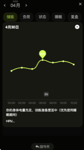

# 日历图表接口文档

---

## 接口：获取日历图表数据



---

**请求方式：** GET

**请求参数：**

| 名称 | 类型   | 必填 | 说明                                      |
| ---- | ------ | ---- | ----------------------------------------- |
| date | String | 是   | 查询日期，格式 YYYY-MM-DD                 |
| tab  | String | 是   | 图表类型：energy/load/status/sleep/review |

### 响应示例

```json
{
  "code": 0,
  "data": [
    { "time": "00:00", "value": 72 },
    { "time": "02:00", "value": 78 },
    { "time": "04:00", "value": 83 },
    { "time": "06:00", "value": 88 },
    { "time": "08:00", "value": 85 },
    { "time": "10:00", "value": 82 },
    { "time": "12:00", "value": 80 },
    { "time": "14:00", "value": 78 },
    { "time": "16:00", "value": 75 },
    { "time": "18:00", "value": 65 },
    { "time": "20:00", "value": 68 },
    { "time": "22:00", "value": 72 }
  ]
}
```

### 响应字段说明

| 名称  | 类型    | 说明         |
| ----- | ------- | ------------ |
| time  | String  | 时间点 HH:mm |
| value | Integer | 指标值       |

### Tab 类型说明

| Tab 值 | 图表类型 | 说明             |
| ------ | -------- | ---------------- |
| energy | 储能     | 当日能量曲线数据 |
| load   | 负荷     | 当日实时负荷数据 |
| status | 状态     | 当日 HRV 数据    |
| sleep  | 睡眠     | 睡眠期间指标数据 |
| review | 复盘     | 超量恢复趋势数据 |

---