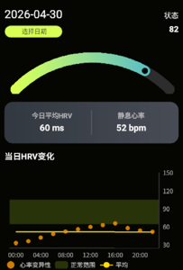
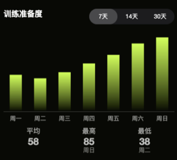

# 状态页面接口文档

---

## 接口1：获取状态页面基础数据



---

**请求方式：** GET

**请求参数：**

| 名称 | 类型   | 必填 | 说明                                          |
| ---- | ------ | ---- | --------------------------------------------- |
| date | String | 否   | 查询指定日期，格式 YYYY-MM-DD，不传则默认当天 |

### 响应示例

```json
{
  "code": 0,
  "data": {
    "totalStatus": 82,
    "statusProgress": 82,
    "hrv": 60,
    "restingHeartRate": 52,
    "hrvData": [
      { "time": "00:00", "value": 33 },
      { "time": "02:00", "value": 36 },
      { "time": "04:00", "value": 42 },
      { "time": "06:00", "value": 48 },
      { "time": "08:00", "value": 52 },
      { "time": "10:00", "value": 56 },
      { "time": "12:00", "value": 60 },
      { "time": "14:00", "value": 63 },
      { "time": "16:00", "value": 66 },
      { "time": "18:00", "value": 58 },
      { "time": "20:00", "value": 54 },
      { "time": "22:00", "value": 52 }
    ]
  }
}
```

### 响应字段说明

| 名称             | 类型    | 说明                 |
| ---------------- | ------- | -------------------- |
| totalStatus      | Integer | 综合状态值 0-100     |
| statusProgress   | Integer | 状态进度百分比 0-100 |
| hrv              | Integer | 心率变异性 ms        |
| restingHeartRate | Integer | 静息心率 bpm         |
| hrvData          | Array   | 当日HRV变化数据      |
| hrvData[].time   | String  | 时间点 HH:mm         |
| hrvData[].value  | Integer | HRV值                |

---

## 接口2：获取训练准备度数据



---

**请求方式：** GET

**请求参数：**

| 名称      | 类型   | 必填 | 说明                      |
| --------- | ------ | ---- | ------------------------- |
| startDate | String | 是   | 开始日期，格式 YYYY-MM-DD |
| endDate   | String | 是   | 结束日期，格式 YYYY-MM-DD |

### 响应示例

```json
{
  "code": 0,
  "data": [
    { "date": "2026-04-23", "value": 42 },
    { "date": "2026-04-24", "value": 38 },
    { "date": "2026-04-25", "value": 45 },
    { "date": "2026-04-26", "value": 55 },
    { "date": "2026-04-27", "value": 65 },
    { "date": "2026-04-28", "value": 78 },
    { "date": "2026-04-29", "value": 85 }
  ]
}
```

### 响应字段说明

| 名称  | 类型    | 说明                  |
| ----- | ------- | --------------------- |
| date  | String  | 日期，格式 YYYY-MM-DD |
| value | Integer | 准备度值              |

---
