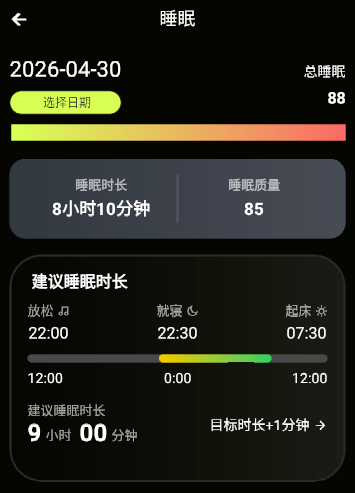
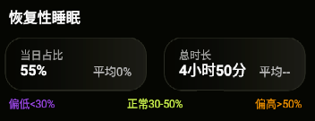
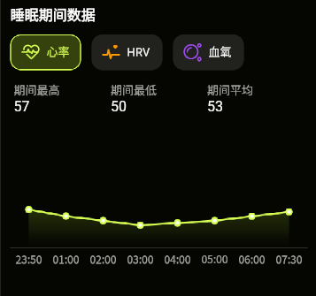
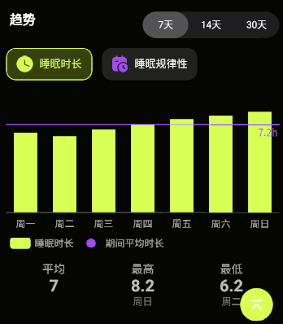
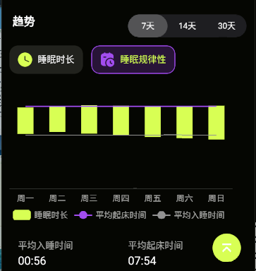

# 睡眠页面接口文档

---

## 接口1：获取睡眠页面基础数据


**请求方式：** GET

**请求参数：**

| 名称 | 类型   | 必填 | 说明                                          |
| ---- | ------ | ---- | --------------------------------------------- |
| date | String | 否   | 查询指定日期，格式 YYYY-MM-DD，不传则默认当天 |

### 响应示例

```json
{
  "code": 0,
  "data": {
    "totalSleep": 88,
    "sleepProgress": 88,
    "sleepDuration": "8小时10分钟",
    "sleepQuality": 85,
    "suggestedSleepDuration": "9:00",
    "recoverySleepPercentage": 55,
    "recoverySleepDuration": "4小时50分",
    "avgRecoverySleepPercentage": "52%",
    "avgRecoverySleepDuration": "4小时30分"
  }
}
```

### 响应字段说明

| 名称                       | 类型    | 说明                              |
| -------------------------- | ------- | --------------------------------- |
| totalSleep                 | Integer | 总睡眠值 0-100                    |
| sleepProgress              | Integer | 睡眠进度百分比 0-100              |
| sleepDuration              | String  | 睡眠时长，如"8小时10分钟"         |
| sleepQuality               | Integer | 睡眠质量百分比 0-100              |
| suggestedSleepDuration     | String  | 建议睡眠时长，如"9:00"            |
| recoverySleepPercentage    | Integer | 恢复性睡眠当日占比                |
| recoverySleepDuration      | String  | 恢复性睡眠总时长，如"4小时50分"   |
| avgRecoverySleepPercentage | String  | 恢复性睡眠平均占比，如"52%"       |
| avgRecoverySleepDuration   | String  | 恢复性睡眠平均时长，如"4小时30分" |

---




---

## 接口2：获取睡眠期间数据


**请求方式：** GET

**请求参数：**

| 名称   | 类型   | 必填 | 说明                           |
| ------ | ------ | ---- | ------------------------------ |
| date   | String | 是   | 查询指定日期，格式 YYYY-MM-DD  |
| metric | String | 是   | 指标类型：heartRate/hrv/oxygen |

### 响应示例

```json
{
  "code": 0,
  "data": [
    { "time": "23:50", "value": 57 },
    { "time": "01:00", "value": 54 },
    { "time": "02:00", "value": 52 },
    { "time": "03:00", "value": 50 },
    { "time": "04:00", "value": 51 },
    { "time": "05:00", "value": 52 },
    { "time": "06:00", "value": 54 },
    { "time": "07:30", "value": 56 }
  ]
}
```

### 响应字段说明

| 名称  | 类型    | 说明         |
| ----- | ------- | ------------ |
| time  | String  | 时间点 HH:mm |
| value | Integer | 指标值       |

---



---

## 接口3：获取睡眠时长趋势数据


**请求方式：** GET

**请求参数：**

| 名称      | 类型   | 必填 | 说明                      |
| --------- | ------ | ---- | ------------------------- |
| startDate | String | 是   | 开始日期，格式 YYYY-MM-DD |
| endDate   | String | 是   | 结束日期，格式 YYYY-MM-DD |

### 响应示例

```json
{
  "code": 0,
  "data": [
    { "date": "2026-04-23", "value": 6.5 },
    { "date": "2026-04-24", "value": 6.2 },
    { "date": "2026-04-25", "value": 6.8 },
    { "date": "2026-04-26", "value": 7.2 },
    { "date": "2026-04-27", "value": 7.6 },
    { "date": "2026-04-28", "value": 7.9 },
    { "date": "2026-04-29", "value": 8.2 }
  ]
}
```

### 响应字段说明

| 名称  | 类型   | 说明                  |
| ----- | ------ | --------------------- |
| date  | String | 日期，格式 YYYY-MM-DD |
| value | Number | 睡眠时长（小时）      |

---



---

## 接口4：获取睡眠模式数据


**请求方式：** GET

**请求参数：**

| 名称      | 类型   | 必填 | 说明                      |
| --------- | ------ | ---- | ------------------------- |
| startDate | String | 是   | 开始日期，格式 YYYY-MM-DD |
| endDate   | String | 是   | 结束日期，格式 YYYY-MM-DD |

### 响应示例

```json
{
  "code": 0,
  "data": {
    "bedtimes": [
      { "date": "2026-04-23", "value": "01:10" },
      { "date": "2026-04-24", "value": "01:40" },
      { "date": "2026-04-25", "value": "01:20" },
      { "date": "2026-04-26", "value": "00:50" },
      { "date": "2026-04-27", "value": "00:30" },
      { "date": "2026-04-28", "value": "00:10" },
      { "date": "2026-04-29", "value": "23:50" }
    ],
    "wakeTimes": [
      { "date": "2026-04-23", "value": "07:40" },
      { "date": "2026-04-24", "value": "07:50" },
      { "date": "2026-04-25", "value": "08:10" },
      { "date": "2026-04-26", "value": "08:00" },
      { "date": "2026-04-27", "value": "07:50" },
      { "date": "2026-04-28", "value": "07:50" },
      { "date": "2026-04-29", "value": "08:00" }
    ],
    "avgBedtime": "00:56",
    "avgWakeTime": "07:54"
  }
}
```

### 响应字段说明

| 名称              | 类型   | 说明                  |
| ----------------- | ------ | --------------------- |
| bedtimes          | Array  | 每日入睡时间列表      |
| bedtimes[].date   | String | 日期，格式 YYYY-MM-DD |
| bedtimes[].value  | String | 入睡时间 HH:mm        |
| wakeTimes         | Array  | 每日醒来时间列表      |
| wakeTimes[].date  | String | 日期，格式 YYYY-MM-DD |
| wakeTimes[].value | String | 醒来时间 HH:mm        |
| avgBedtime        | String | 平均入睡时间 HH:mm    |
| avgWakeTime       | String | 平均醒来时间 HH:mm    |

---



---
