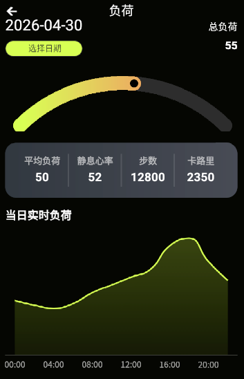
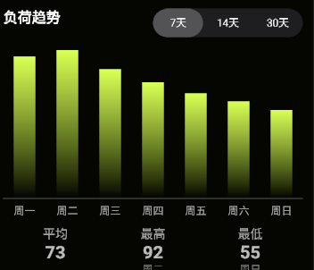
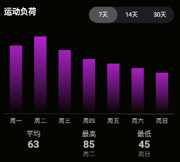
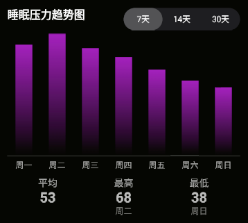

# 负荷页面接口文档

---

## 接口1：获取负荷页面基础数据

**请求方式：** GET

**请求参数：**

| 名称 | 类型   | 必填 | 说明                                          |
| ---- | ------ | ---- | --------------------------------------------- |
| date | String | 否   | 查询指定日期，格式 YYYY-MM-DD，不传则默认当天 |

### 响应示例

```json
{
  "code": 0,
  "data": {
    "totalLoad": 55,
    "loadProgress": 55,
    "avgLoad": 50,
    "restingHeartRate": 52,
    "steps": 12800,
    "calories": 2350,
    "realtimeLoadData": [
      { "time": "00:00", "value": 35 },
      { "time": "02:00", "value": 32 },
      { "time": "04:00", "value": 30 },
      { "time": "06:00", "value": 33 },
      { "time": "08:00", "value": 40 },
      { "time": "10:00", "value": 45 },
      { "time": "12:00", "value": 50 },
      { "time": "14:00", "value": 55 },
      { "time": "16:00", "value": 70 },
      { "time": "18:00", "value": 75 },
      { "time": "20:00", "value": 60 },
      { "time": "22:00", "value": 48 }
    ],
    "loadZones": {
      "overload": { "percentage": 8, "hours": 2 },
      "warning": { "percentage": 25, "hours": 6 },
      "normal": { "percentage": 42, "hours": 10 },
      "excellent": { "percentage": 17, "hours": 4 }
    },
    "heartRateZoneData": [
      { "time": "00:00", "value": 62 },
      { "time": "03:00", "value": 58 },
      { "time": "06:00", "value": 56 },
      { "time": "09:00", "value": 60 },
      { "time": "12:00", "value": 78 },
      { "time": "15:00", "value": 110 },
      { "time": "18:00", "value": 135 },
      { "time": "21:00", "value": 172 }
    ],
    "heartRateZoneItems": {
      "zone5": 0,
      "zone4": 8,
      "zone3": 8,
      "zone2": 33,
      "zone1": 25,
      "zone0": 25
    }
  }
}
```

### 响应字段说明

| 名称                       | 类型    | 说明                 |
| -------------------------- | ------- | -------------------- |
| totalLoad                  | Integer | 总负荷值 0-100       |
| loadProgress               | Integer | 负荷进度百分比 0-100 |
| avgLoad                    | Integer | 平均负荷             |
| restingHeartRate           | Integer | 静息心率 bpm         |
| steps                      | Integer | 步数                 |
| calories                   | Integer | 卡路里               |
| realtimeLoadData           | Array   | 当日实时负荷数据     |
| realtimeLoadData[].time    | String  | 时间点 HH:mm         |
| realtimeLoadData[].value   | Integer | 负荷值               |
| loadZones                  | Object  | 负荷区间状态         |
| loadZones.overload         | Object  | 负荷过载区间         |
| loadZones.warning          | Object  | 注意负荷区间         |
| loadZones.normal           | Object  | 状态正常区间         |
| loadZones.excellent        | Object  | 状态优秀区间         |
| loadZones.*.percentage     | Integer | 占比百分比           |
| loadZones.*.hours          | Integer | 时长                 |
| heartRateZoneData          | Array   | 心率区间趋势数据     |
| heartRateZoneData[].time   | String  | 时间点 HH:mm         |
| heartRateZoneData[].value  | Integer | 心率值               |
| heartRateZoneItems         | Object  | 心率区间分布         |
| heartRateZoneItems.zone0-5 | Integer | 各Zone占比百分比     |

---




---

## 接口2：获取负荷趋势数据


**请求方式：** GET

**请求参数：**

| 名称      | 类型   | 必填 | 说明                      |
| --------- | ------ | ---- | ------------------------- |
| startDate | String | 是   | 开始日期，格式 YYYY-MM-DD |
| endDate   | String | 是   | 结束日期，格式 YYYY-MM-DD |

### 响应示例

```json
{
  "code": 0,
  "data": [
    { "date": "2026-04-23", "value": 88 },
    { "date": "2026-04-24", "value": 92 },
    { "date": "2026-04-25", "value": 80 },
    { "date": "2026-04-26", "value": 72 },
    { "date": "2026-04-27", "value": 65 },
    { "date": "2026-04-28", "value": 60 },
    { "date": "2026-04-29", "value": 55 }
  ]
}
```

### 响应字段说明

| 名称  | 类型    | 说明                  |
| ----- | ------- | --------------------- |
| date  | String  | 日期，格式 YYYY-MM-DD |
| value | Integer | 负荷值                |

---



---

## 接口3：获取运动负荷数据


**请求方式：** GET

**请求参数：**

| 名称      | 类型   | 必填 | 说明                      |
| --------- | ------ | ---- | ------------------------- |
| startDate | String | 是   | 开始日期，格式 YYYY-MM-DD |
| endDate   | String | 是   | 结束日期，格式 YYYY-MM-DD |

### 响应示例

```json
{
  "code": 0,
  "data": [
    { "date": "2026-04-23", "value": 75 },
    { "date": "2026-04-24", "value": 85 },
    { "date": "2026-04-25", "value": 70 },
    { "date": "2026-04-26", "value": 60 },
    { "date": "2026-04-27", "value": 55 },
    { "date": "2026-04-28", "value": 50 },
    { "date": "2026-04-29", "value": 45 }
  ]
}
```

### 响应字段说明

| 名称  | 类型    | 说明                  |
| ----- | ------- | --------------------- |
| date  | String  | 日期，格式 YYYY-MM-DD |
| value | Integer | 运动负荷值            |

---



---

## 接口4：获取睡眠压力数据


**请求方式：** GET

**请求参数：**

| 名称      | 类型   | 必填 | 说明                      |
| --------- | ------ | ---- | ------------------------- |
| startDate | String | 是   | 开始日期，格式 YYYY-MM-DD |
| endDate   | String | 是   | 结束日期，格式 YYYY-MM-DD |

### 响应示例

```json
{
  "code": 0,
  "data": [
    { "date": "2026-04-23", "value": 62 },
    { "date": "2026-04-24", "value": 68 },
    { "date": "2026-04-25", "value": 60 },
    { "date": "2026-04-26", "value": 55 },
    { "date": "2026-04-27", "value": 48 },
    { "date": "2026-04-28", "value": 42 },
    { "date": "2026-04-29", "value": 38 }
  ]
}
```

### 响应字段说明

| 名称  | 类型    | 说明                  |
| ----- | ------- | --------------------- |
| date  | String  | 日期，格式 YYYY-MM-DD |
| value | Integer | 睡眠压力值            |

---



---
