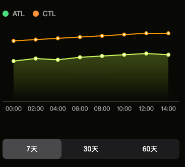

# 超量恢复页面接口文档

---

## 接口1：获取超量恢复基础数据


**请求方式：** GET


### 响应示例

```json
{
  "code": 0,
  "data": {
    "tsb": 36,
    "atl": 37,
    "ctl": 54
  }
}
```

### 响应字段说明

| 名称 | 类型    | 说明          |
| ---- | ------- | ------------- |
| tsb  | Integer | TSB训练状态值 |
| atl  | Integer | 短期负荷值    |
| ctl  | Integer | 长期负荷值    |

---


---

## 接口2：获取ATL/CTL趋势数据


**请求方式：** GET

**请求参数：**

| 名称      | 类型   | 必填 | 说明                      |
| --------- | ------ | ---- | ------------------------- |
| startDate | String | 是   | 开始日期，格式 YYYY-MM-DD |
| endDate   | String | 是   | 结束日期，格式 YYYY-MM-DD |

### 响应示例

```json
{
  "code": 0,
  "data": [
    { "date": "2026-04-23", "atl": 32, "ctl": 48 },
    { "date": "2026-04-24", "atl": 34, "ctl": 49 },
    { "date": "2026-04-25", "atl": 33, "ctl": 50 },
    { "date": "2026-04-26", "atl": 35, "ctl": 51 },
    { "date": "2026-04-27", "atl": 36, "ctl": 52 },
    { "date": "2026-04-28", "atl": 37, "ctl": 53 },
    { "date": "2026-04-29", "atl": 38, "ctl": 54 }
  ]
}
```

### 响应字段说明

| 名称 | 类型    | 说明                  |
| ---- | ------- | --------------------- |
| date | String  | 日期，格式 YYYY-MM-DD |
| atl  | Integer | 短期负荷值            |
| ctl  | Integer | 长期负荷值            |

---



---
