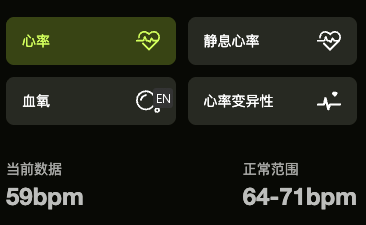
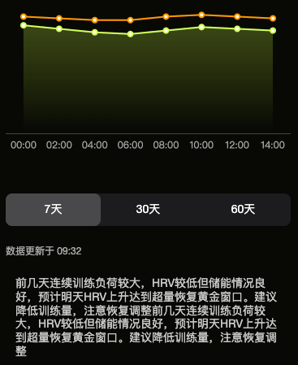

## 接口：获取身体指标数据


**请求方式：** GET

**请求参数：**

| 名称      | 类型   | 必填 | 说明                                                 |
| --------- | ------ | ---- | ---------------------------------------------------- |
| metric    | String | 是   | 指标类型：heartRate/restingHeartRate/bloodOxygen/hrv |
| startDate | String | 是   | 开始日期，格式 YYYY-MM-DD                            |
| endDate   | String | 是   | 结束日期，格式 YYYY-MM-DD                            |

### 响应示例

```json
{
  "code": 0,
  "data": {
    "currentData": "59bpm",
    "normalRange": "64-71bpm",
    "trendData": [
      { "date": "2026-04-23", "value": 62 },
      { "date": "2026-04-24", "value": 60 },
      { "date": "2026-04-25", "value": 58 },
      { "date": "2026-04-26", "value": 57 },
      { "date": "2026-04-27", "value": 59 },
      { "date": "2026-04-28", "value": 61 },
      { "date": "2026-04-29", "value": 59 }
    ],
    "analysisText": "前几天连续训练负荷较大，HRV较低但储能情况良好，预计明天HRV上升达到超量恢复黄金窗口。建议降低训练量，注意恢复调整。",
    "updateTime": "09:32"
  }
}
```

### 响应字段说明

| 名称              | 类型    | 说明                  |
| ----------------- | ------- | --------------------- |
| currentData       | String  | 当前数据值            |
| normalRange       | String  | 正常范围              |
| trendData         | Array   | 趋势数据列表          |
| trendData[].date  | String  | 日期，格式 YYYY-MM-DD |
| trendData[].value | Integer | 指标值                |
| analysisText      | String  | 分析建议文本          |
| updateTime        | String  | 数据更新时间 HH:mm    |

---




---
