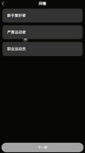
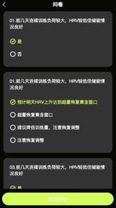

# 问卷页面接口文档

---

## 接口1：获取问卷内容



---

**请求方式：** GET

**请求路径：** `/app/questionnaire`

**请求参数：** 无

### 响应示例

```json
{
  "code": 0,
  "data": {
    "userTypes": [
      { "label": "新手爱好者", "value": "beginner" },
      { "label": "严肃运动者", "value": "serious" },
      { "label": "职业运动员", "value": "professional" }
    ],
    "questions": [
      {
        "text": "01.前几天连续训练负荷较大，HRV较低但储能情况良好",
        "options": [
          { "label": "是", "value": "yes" },
          { "label": "否", "value": "no" }
        ]
      },
      {
        "text": "02.预计明天HRV上升达到超量恢复黄金窗口",
        "options": [
          { "label": "预计明天HRV上升达到超量恢复黄金窗口", "value": "window" },
          { "label": "超量恢复黄金窗口", "value": "window2" },
          { "label": "建议降低训练量，注意恢复调整", "value": "reduce" },
          { "label": "注意恢复调整", "value": "adjust" }
        ]
      }
    ]
  }
}
```

### 响应字段说明

| 名称                        | 类型   | 说明             |
| --------------------------- | ------ | ---------------- |
| userTypes                   | Array  | 用户类型选项列表 |
| userTypes[].label           | String | 用户类型显示名称 |
| userTypes[].value           | String | 用户类型值       |
| questions                   | Array  | 问卷问题列表     |
| questions[].text            | String | 问题文本         |
| questions[].options         | Array  | 问题选项列表     |
| questions[].options[].label | String | 选项显示名称     |
| questions[].options[].value | String | 选项值           |

---

## 接口2：提交问卷答案


**请求方式：** POST

**请求路径：** `/app/questionnaire/submit`

**请求参数：**

| 名称     | 类型   | 必填 | 说明                                      |
| -------- | ------ | ---- | ----------------------------------------- |
| userType | String | 是   | 用户类型值：beginner/serious/professional |
| answers  | Array  | 是   | 用户答案列表                              |

**请求参数示例：**

```json
{
  "userType": "beginner",
  "answers": [
    { "question": "01.前几天连续训练负荷较大，HRV较低但储能情况良好", "selected": "yes" },
    { "question": "02.预计明天HRV上升达到超量恢复黄金窗口", "selected": "window" }
  ]
}
```

### 响应示例

```json
{
  "code": 0,
  "message": "提交成功"
}
```

### 响应字段说明

| 名称    | 类型   | 说明     |
| ------- | ------ | -------- |
| message | String | 响应信息 |

---