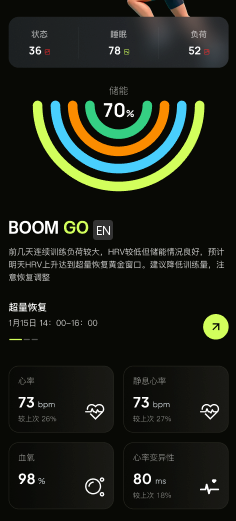

# 首页接口文档

---

<!-- 接口截图 -->


---

## 接口：获取首页训练状态

**请求方式：** GET

**请求参数：** 无

### 响应示例

```json
{
  "code": 0,
  "data": {
    "healthStatus": {
      "status": 82,
      "sleep": 88,
      "load": 55
    },
    "boomGoText": "hi！现在是你的最佳训练窗口，建议进行高质量训练！如果不练，我都替你感觉亏！",
    "energyPercentage": 88,
    "healthCardValues": {
      "heartRate": 64,
      "restingHeartRate": 52,
      "oxygen": 98,
      "hrv": 62
    },
    "details": {
      "supercompensationTime": "次日 10:00 – 14:00",
      "suggestion": "中高强度训练（阈值 / 间歇）",
      "duration": "60–90分钟",
      "target": "提升能力上限（耐力/阈值）"
    }
  }
}
```

### 响应字段说明

| 名称                              | 类型    | 说明                   |
| --------------------------------- | ------- | ---------------------- |
| healthStatus                      | Object  | 健康状态               |
| healthStatus.status               | Integer | 综合状态百分比 0-100   |
| healthStatus.sleep                | Integer | 睡眠状态百分比 0-100   |
| healthStatus.load                 | Integer | 负荷状态百分比 0-100   |
| boomGoText                        | String  | BOOM GO 模块的文案     |
| energyPercentage                  | Integer | 储能环形图百分比 0-100 |
| healthCardValues                  | Object  | 健康卡片数值           |
| healthCardValues.heartRate        | Integer | 当前心率 bpm           |
| healthCardValues.restingHeartRate | Integer | 静息心率 bpm           |
| healthCardValues.oxygen           | Integer | 血氧饱和度 %           |
| healthCardValues.hrv              | Integer | 心率变异性 ms          |
| details                           | Object  | 超量恢复详情           |
| details.supercompensationTime     | String  | 超量恢复时间段         |
| details.suggestion                | String  | 训练建议（可选）       |
| details.duration                  | String  | 建议时长（可选）       |
| details.target                    | String  | 训练目标（可选）       |

---
